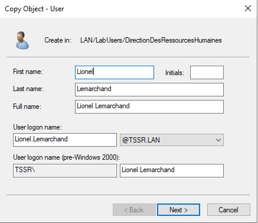
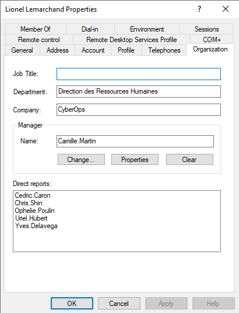

## EXERCICE 1 : Manipulations pratiques sur VM Windows 

### Partie 1 : Gestion des utilisateurs  

#### Q.1.1.1  

- Copier/Coller l'utilisateur Kelly Rhameur.
- Remplir les champs de création d'un nouvel utilisateur avec Lionel Lemarchand

Cela permet de conserver les nombreux attributs déjà présent sur la première configuration (Kelly.R)

J'ai juste ajouté manuellement les **direct report** en allant sur chaque membre de mon équipe pour leur modifier leur manager
- Pour cela, `Properties`>`Organization`>`Change`>"Indiquer Lionel => Check Names">`Apply`

  

  

  

---

#### Q.1.1.2  

- Clique droit sur _LabUsers_
- Selectionner _New_ > _Organizational Unit_
- Choisir le nom **DeactivatedUsers**
- Clique droit sur Kelly.R
- Selectionner _Move_ > Choisir l'OU **DeactivatedUsers**

  

---

#### Q.1.1.3  

- Clique droit sur le groupe "GrpUsersDirectionDesRessourcesHumaines" présent dans l'OU DirectionDesRessourcesHumaines.
- Séléctionner _Properties_ > Kelly.R > _Remove_

  

  

---

#### Q.1.1.4  

Se rendre dans le disque F:DossiersIndividuels.
- Créer un nouveau dossier au nom de lionel.lemarchand
- Renommer le dossier de Kelly.Rhameur avec le suffixe -ARCHIVE

  

---

### Partie 2 : Restriction utilisateurs  

#### Q.1.2.1  

  

---

#### Q.1.2.2  

  

---

#### Q.1.2.3  

  

  

---

### Partie 3 : Lecteurs réseaux  
#### Q.1.3.1  

Pour le mappage, il est idéal de créer un partage de dossier sur les différents disque.
- Clique droit sur le F puis le E, sharing, choisir les permissions, pas d'option de sécurité pour ce cas mais la bonne pratique est de donner le strict nécessaire en droits d'accès.
- Ensuite comme le montre la premiere capture, créer un GPO pour faire le mappage. Idem pour les droits d'accès, la bonne pratique serait de cibler via l'onglet common > Item-Targeting, le mappage au groupe voulu. 

  

  

